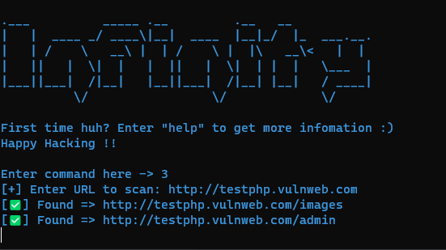
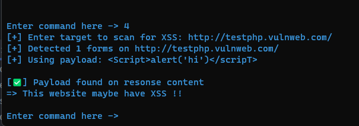

# Infinity tool - Bộ công cụ dò quét bảo mật (Basic Level)
Đây là bộ công cụ kiểm thử bảo mật được phát triển bởi nhóm 8 môn Kỹ Thuật Lập Trình do thầy Thắng phụ trách

Bộ công cụ này sẽ hỗ trợ các chuyên gia bảo mật trong việc dò quét cũng như là thu thập thông tin về mục tiêu tấn công

Tuy nhiên đây mới chỉ là phiên bản sơ khai, còn nhiều thiếu sót, sẽ được update dần dần

## Một số hình ảnh của bộ công cụ Infinity

Hình ảnh đầu tiên khi khởi chạy bộ công cụ Infinity

Đây là sử dụng chức năng directory scan

Còn đây là hình ảnh khi sử dụng chức năng xss detection

## Hướng dẫn cài đặt

- Để có thể sử dụng được bộ công cụ này thì đầu tiên ta cần cài đặt các thư viện cần thiết

    `pip install bs4` thư viện beautifulsoup 

    `pip install python-nmap` module nmap trong python

    `pip install requests` thư viện request để gửi các request GET/POST,... lên server bằng python

- Tiếp đó clone chương trình về sử dụng git `git clone https://github.com/quangdaik2362001/infinity`

- Sau khi clone về ta hãy lên quyền `root` và cấp quyền cho thư mục infinity bằng câu lệnh `chmod -R 777 infinity`

- Sau khi đã cấp quyền xong thì ta vào thư mục infinity và chạy file `main.py` bằng câu lệnh `python main.py` (lưu ý là đang trong root terminal nhé)

## Các chức năng chính

- Scan host để thu thập thông tin về các service port & các thông tin về os 
- Thay đổi địa chỉ MAC, để tăng khả năng ẩn mình
- Dò quét các địa chỉ có thể có của 1 website nào đó để có thể tìm ra các file sensitive
- Dò quét và kiểm tra thử lỗ hổng bảo mật XSS

## Thông tin về nhóm
Nhóm gồm có 4 thành viên:
- Nguyễn Minh Quang 
- Đỗ Thị Trà Ly
- Nguyễn Ngọc Bảo
- Trương Đình Hoàn
